# Setting up connected worlds with your data using GitLab, Bitbucket or GitHub

## Contents:

- [Notes](#notes)
- [Steps](#steps)
- [Importing Connected Worlds](#importing Connected Worlds)
    - [Importing into GitLab](#importing into GitLab)
    - [Importing into GitHub](#importing into GitHub)
    - [Importing into Bitbucket](#importing into Bitbucket)
- [Deploying](#deploying)
    - [Setting up surge and node](#setting up surge and node)
    - [Setting up your CI service](#setting up your CI service)
        - [GitLabCI](#gitLabCI)
        - [CircleCI](#circleCI)
- [Using your own data](#using your own data)

## Notes:
1. This guide is designed for someone with a reasonable knowledge of the chosen git services and some technical experience.
2. GitLab will use GitLab CI and both GitHub and Bitbucket will use CircleCI.
3. It is assumed that you will have all relevant accounts and all the needed permissions to follow this guide.
4. It also assumes you are deploying to surge.sh, if you are not then you will need to edit the deploy script to suit your implementation.

## <a name="Steps"></a> Steps:
The only two required steps for running your own connected worlds platform are importing the repository and setting up surge deployment.

If you are planning on deploying to somewhere other than surge or don't plan to deploy in this way you may skip the surge deployment section of the below guide. Due to the sheer number of platforms available to deploy to, we have only made connected worlds support surge by default. This means that if you want to deploy elsewhere you will need to edit the CI scripts your self. This will require more technical knowledge than following this guide as less of the work will have been done for you. Not doing this may require some code to be removed from the CI files if you still use a CI service. If you just want to deploy locally then you can  download the project to your pc and run `yarn start` from a terminal.

## <a name="Importing Connected Worlds"></a> Importing Connected Worlds:

Note in all cases the repository may take a few minutes to import.

### <a name="Importing into GitLab"></a> Importing into GitLab:

1. Login to GitLab.
2. Click on "New project" in the top right corner of the screen.
3. Click on "Repo by URL".
4. Click on "Import project" and then paste the following URL:

https://github.com/eResearchSandpit/VR-Network-Vis

or here if you have access:

https://gitlab.ecs.vuw.ac.nz/ENGR301-302-2018/Project-10/VR-Network-Vis


5. Scroll down and rename the project if you would like.
6. Set the visibility level of the project(Private, Internal or Public).
7. Click create project.

In the deployment section follow the GitLabCI guide NOT the CircleCI guide.

### <a name="Importing into GitHub"></a> Importing into GitHub:

1. Login to GitHub.
2. Press the "+" symbol in the top right corner of GitHub next to you profile picture.
3. Click "Import repository".

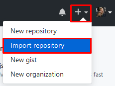

4. On the following screen input a name for the repo and then paste the following URL:

https://github.com/eResearchSandpit/VR-Network-Vis

or here if you have access:

https://gitlab.ecs.vuw.ac.nz/ENGR301-302-2018/Project-10/VR-Network-Vis

5. Press begin import.

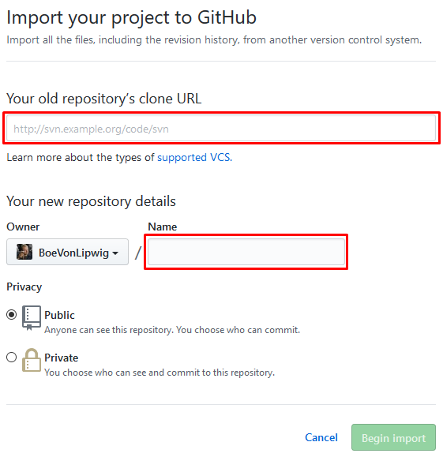

In the deployment, section follow the CircleCI guide NOT the GitLabCI guide.

### <a name="Importing into Bitbucket"></a> Importing into Bitbucket:
1. Start by logging in to Bitbucket.
2. Press the "+" symbol in the top left of your screen in the menu bar

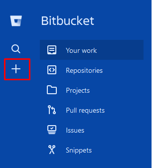

3. Then press "Repository" under the import section of the menu.

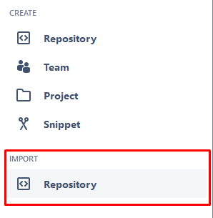

4. Then name the repository and input the following URL:

https://github.com/eResearchSandpit/VR-Network-Vis

or here if you have access:

https://gitlab.ecs.vuw.ac.nz/ENGR301-302-2018/Project-10/VR-Network-Vis

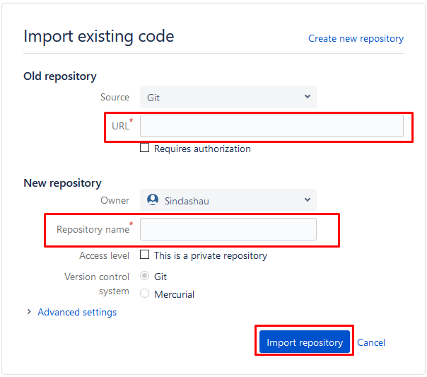

5. Set the visibility level of the project(Private or Public).
6. Click "Import repository".

In the deployment section follow the CircleCI guide NOT the GitLabCI guide.

## <a name="Deploying"></a> Deploying:

Note that if you are using GitLab the CI script is set up to deploy to GitLab pages automatically.

### <a name="Setting up surge and node"></a> Setting up surge and node:
1. Install NodeJS from the following link: [Node installer](https://nodejs.org) and follow the on screen instructions.
2. Open cmd or some command line equivalent and run the following commands:
```
npm install --global surge
surge token
```
and follow the instructions on screen(remember the details you input they will be used).
3. Save the token that surge outputs for later.

### <a name="Setting up your CI service"></a> Setting up your CI service:

Note: follow the GitLabCI guide if you are using GitLab and the CircleCI guide if you are using CircleCI.

#### <a name="GitLabCI"></a> GitLabCI:

1. Go to the "CI/CD" tab in settings:

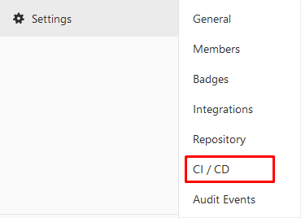

2. Expand the "Variables" tab and add three fields called:
    1. "SURGE_LOGIN".
    2. "SURGE_TOKEN".
    3. "URL".
3. Input the following values into each field:
    1. In the "SURGE_LOGIN" field input the email you used to generate the token.
    2. In the "SURGE_TOKEN" field input the token that you got from the "Setting up surge and node" step.
    3. In the "URL" field input whatever URL you want to use for your site so long as it ends in .surge.sh and is not already taken(You can test this by trying to visit it).
4. Click "Save".

#### <a name="CircleCI"></a> CircleCI:

1. Login to CircleCI using the account related to your project.
2. Click add project button:


3. Locate your project in the list of repositories and click add project.

4. From the change the language from node to other:

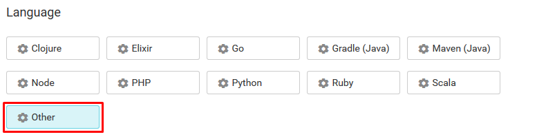

5. Click "Start Building"

6. The build should fail at this point as the environment variables have not been set

7. Click jobs and then the settings cog next to the correct repository name.

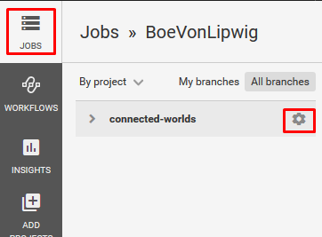

8. Click on "Environment Variables"

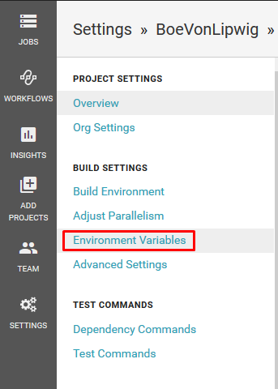

9. Click add variable and enter the names and values into the appropriate slot:

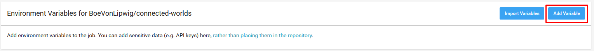

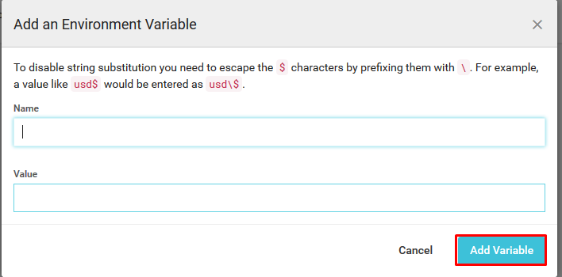


|#|Name |Value |
|----|----|----|
|1|"SURGE_LOGIN" |The email you used to generate the token|
|2|"SURGE_TOKEN" |The token that you got from the "Setting up surge and node" step|
|3|"URL" |The URL you want to use for your site so long as it ends in .surge.sh and is not already taken(You can test this by trying to visit it)|


## <a name="Using your own data"></a> Using your own data
See the [data-uploading-and-formatting document](documentation/guides/Data Uploading and Formatting) for instructions.
