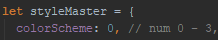

# Future Developments

Below are further ideas we had to improve Connected Worlds. It outlines the
desired change and provides some of our own insight in to how this would be best
implemented.

## Theme switcher

Early on in development we introduced a way of switching the theme of the
website internally. This can be found inside `Cytoscape.js` on line 550.



By changing this number between 0 and 3 it would pick one of the themes within
`src/assets/colors.json`. We wanted to implement a way to change the theme
within the web app. This could be done by creating a React Component
that set the theme number. Using `CytoscapeStore.js` as a place to store the
number, an autorun method method could be setup in `Cytoscape.js` to listen for
any changes to the value, and reset the colours of the cytoscape elements.
Please refer to [js.cytoscape.org](http://js.cytoscape.org/#style) to learn
about style changes.

## Nodes having direct links

Each element in the cytoscape object has a unique ID assigned to it when the
data is parsed from `parser/csv_parser.py`. You can use this to provide
direct links to specific nodes in the web app.

One way we recommend doing this is by integrating
[Aviator](https://github.com/swipely/aviator). This allows you to read the
incoming URI which could provide the node ID inside it. You can then implement
a method that will emit the cytoscape
[emit event method](http://js.cytoscape.org/#cy.emit) for that node which should
take care of the reframing of the node for you.

The link will also need to ensure the layout is selected, of which each id for
the current layouts are found in `Views.js`. The special node to focus on will
also need to be passed in if you are directing to any layout other than the
collaborators layout. This can be set through `CytoscapeStore.js` with
`layoutID` and `focusType`.

This feature would also allow the back button navigation of the web browser to
have some function if the URI is updated each time the node is selected.

## Nodes having tags

The idea of having node tags is more in line with having other ways to search
the data, other than the current implementation which only searches the nodes by
their name. 

Node tags can be stored within the node elements as another field
inside their data structure. The tags are expected to be static and not created
or manipulated when running the web app, so they should be stored within the CSV
files. Before manipulating the CSV files to introduce "tags" to search nodes
with. You can make use of existing fields such as _programme_.

As `Search.js` uses [fuse.js](http://fusejs.io/), it is easy to change what it
will use to search the data with by adjusting the options in the constructor of
`Search.js`. You will find all the options for tweaking the search results of
fuse.js on the website.

One way you could add tags in to the search functionality is by storing each tag
once inside the data collection for Fuse. This way you could have a "Python" tag
be displayed in the search results. This would require modification of the
handleNodeHover method in `Search.js` to make it so when you highlight the tag
result, all the nodes with that tag are highlighted in the graph.

A simpler alternative would be to allow searching of tags, but still show the
names of nodes in the search results. This would require a very small change to
the search options by including the data field you wish to search on. For
example, if I wanted to be able to search by programme also, the options would
look like this: 

``` javascript
let options = {
  keys: ["name", "programme"]
};
```
