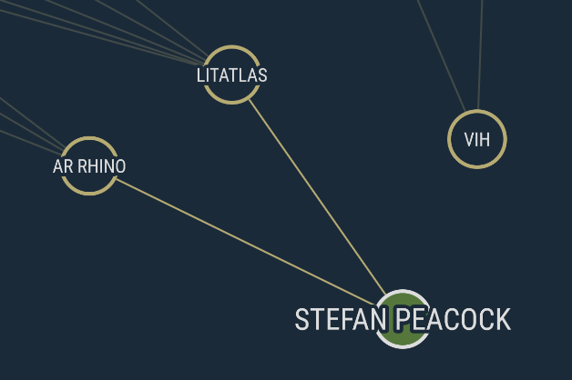
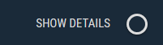
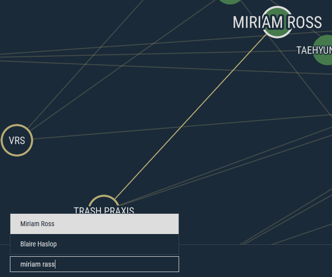
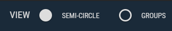
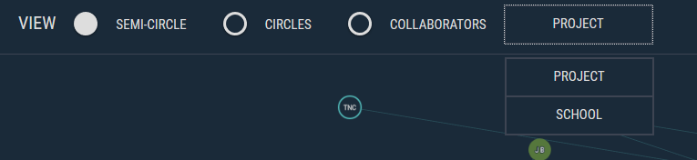

# User Manual

This manual is a guide to utilising the basic functionality of the project.

## Contents:
- [Interacting with Nodes](#interacting-with-nodes)
    - [Selecting a Node](#selecting-a-node)
    - [Moving a Node](#moving-a-node)
- [Toggling Details](#toggle-details-pane)
- [Search](#search)
- [Switching Views](#switching-views)
- [Change Special Node Filter](#change-special-node-filter)

### Interacting with Nodes

This can be done through two simple actions, clicking or searching for a node.

#### Selecting a Node

All nodes apart from the keys in the left legend box are interactable. Upon hovering the mouse over an interactable node, it will highlight itself, its related nodes, and its connections. While hovering the mouse over a node, you can click on it which will select the node and show various details (name, website etc) about it in the details pane on the top right of the page.

#### Moving a Node

To move a node simply hover over the node you wish to move and click and drag it to the position that you would like it to be.

### Toggle Details Pane

In the top right of the screen there is a toggleable button the allows you to choose weather you want the details pane shown or not. When toggled on it will display the nodes information and when off it will minimise out of sight.

### Search

Located on the bottom left, there is a search box. This is where you can input the name of any interactable node to select the node. The search feature tolerates spelling mistakes and it will try to predict them. Upon searching, it will bring up a list of results. You can then hover over these results to highlight the result and all related nodes and connections. Upon clicking on a result, the chosen result is selected and enlarges details
about it in the details pane.

### Switching Views

On the topbar of the application, there are radio buttons for three different views. Currently, the two views named semi-circle and Circles which display the special node type specified by the drop down menu to the right. The collaborators view is a single circle displaying only person nodes.

### Change Special Node Filter

To change the special nodes shown in each of the primary views, select the drop down menu and click on one of the options. This will change the view to filter out all other non normal nodes and only show the normal nodes that are relevant.

