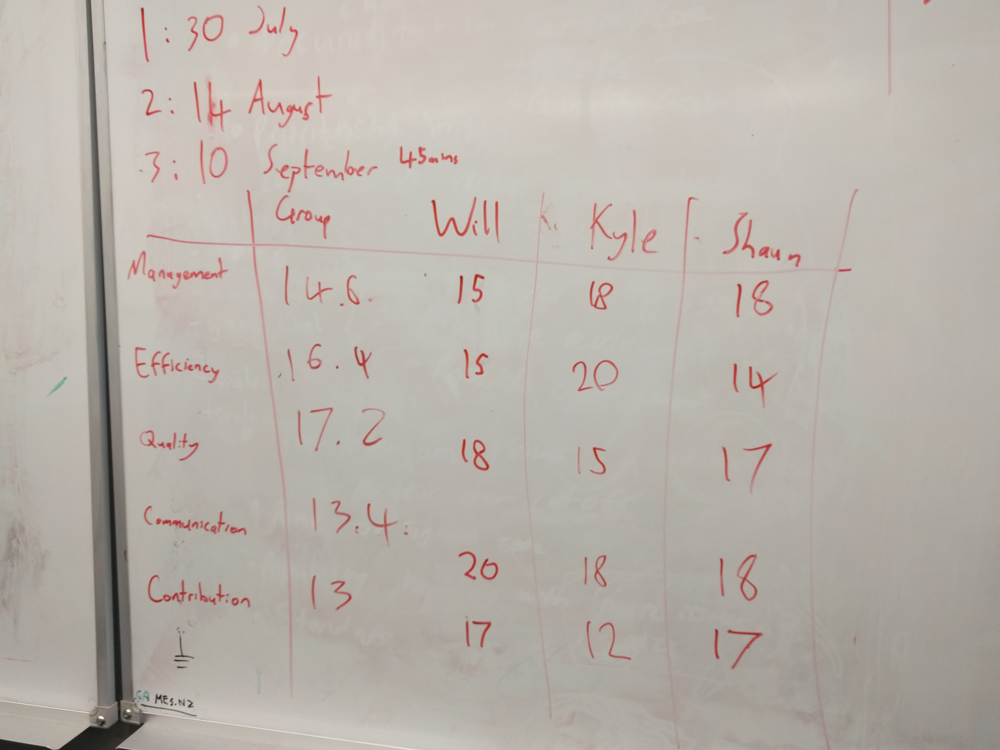
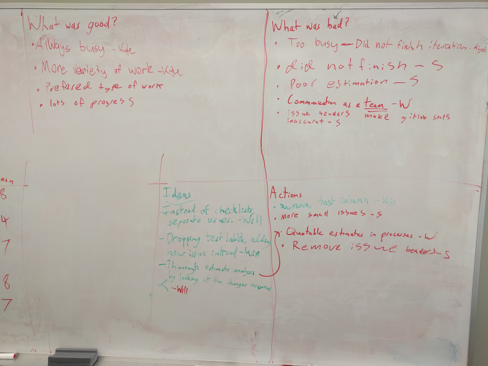

# Retrospective for iteration 3
## Self ratings:

## Retrospective feedback chart:

## Notes on iteration:
We did not complete this iteration.
This was because we underestimated the amount of time it would take to complete certain large complex tasks and as a result spilt the work poorly and added more tasks than where possible for us to complete. This was mainly due to poor procedures for assigning estimates and poor some failures in communication.
To solve this problem we have added a step in our post retrospective team meetings where after creating a set of issues from the stories assigned to the iteration we give each issue a estimate based of our experience with similar issues and are required to justify each one to the group. This will hopefully remove the possibility for issues to be given to small or to large a time estimate and allow us to balance our workload more evenly.
