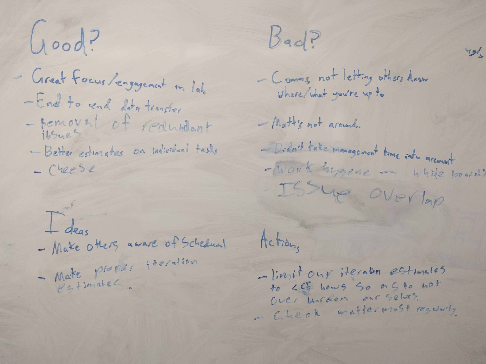
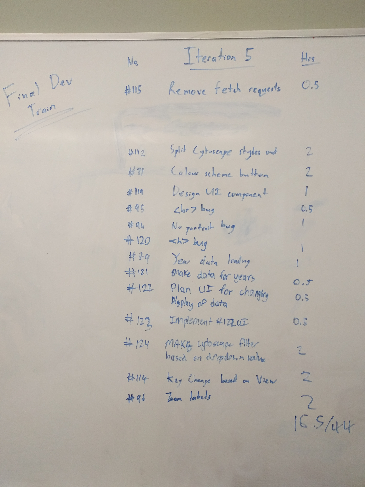

# Retrospective for iteration 4
## Retrospective feedback chart:

## Planning:

## Notes on iteration:
We found that as a result of our actions taken after [retrospective 3](retrospective notes/iteration 3), our estimates on issues were far more accurate. However, we did not take in to account the time taken in labs to manage the project. This comes down to working on the board, doing a retrospective, etc. As a result, we are limiting our expected workload on issues to be an average of 3-3.5 hours per lab. The remaining time is spent doing management related tasks.

Communication was a downfall of the team this iteration. We have reemphasized the need to check the team [Mattermost](https://mattermost.ecs.vuw.ac.nz/engr300-2018/channels/project-10) at least once per day among the team members.
